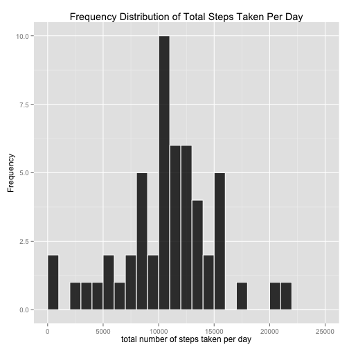
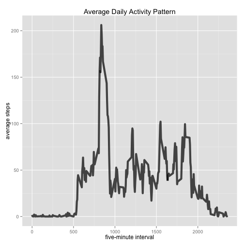
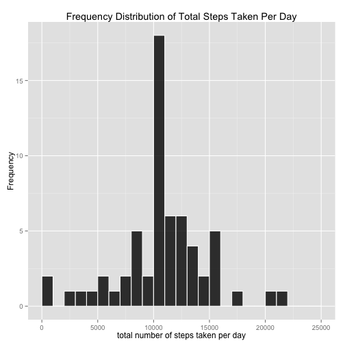
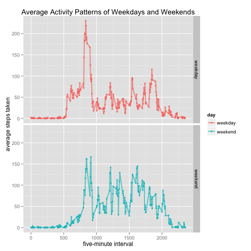

### The purpose of the assignment

This assignment is implemented to develop the ability to write a reproducible research report based on a dataset using knitr.

### Description of the data

In this assignment, I use the data from a personal activity monitoring device. This device collects data at 5 minute intervals through out the day. The data consists of two months of data from an anonymous individual collected during the months of October and November, 2012 and include the number of steps taken in 5 minute intervals each day.  

The original dataset is stored in a comma-separated-value (CSV) file and there are a total of 17,568 observations in this dataset. Here is the [download link](https://d396qusza40orc.cloudfront.net/repdata%2Fdata%2Factivity.zip).  

The data have three variables, namely, steps, date, and interval.  

- steps: Number of steps taking in a 5-minute interval (missing values are coded as NA)
- date: The date on which the measurement was taken in YYYY-MM-DD format
- interval: Identifier for the 5-minute interval in which measurement was taken

### Loading and preprocessing the data

I load the data in the format of data frame and assign it to the variable "activity". Then convert the dataset into tbl class, which is easier to manipulate the data.


```r
library(dplyr)
activity <- read.csv("./activity.csv",header=T)
activity <- tbl_df(activity)
```

### What is mean total number of steps taken per day?

In this step, I want to know how many steps in total this person moves in each day. So I group the data by date and calculate the daily sum of the steps of 5 minute intervals.

```r
total_per_day <- activity %>%
    group_by(date) %>%
    summarise(sum=sum(steps)) %>%
    filter(!is.na(sum))
```

Below is what the daily total steps the subject takes in the two months look like in histogram.


```r
library(ggplot2)
hist_total <- ggplot(total_per_day,aes(sum)) + xlim(0,25000)
hist_total + geom_histogram(binwidth=1000,colour = "white",fill = "black",alpha=0.8) +
  xlab("total number of steps taken per day") +
  ylab("Frequency") + 
  ggtitle("Frequency Distribution of Total Steps Taken Per Day") 
```

 

With daily total steps calculated, I want to know the mean and median value of daily total steps in the two months. I calculate them and assign them to "mean_per_day" and "median_per_day".  


```r
options(scipen=3, digits=2)
mean_per_day <- mean(total_per_day$sum)
median_per_day <- median(total_per_day$sum)
mean_per_day
```

```
## [1] 10766
```

```r
median_per_day
```

```
## [1] 10765
```

I found there is no significant difference between the mean total number of steps taken per day,10766.19, and its median, 10765. So there is little skewness in the distribution of total number od steps taken per day across the two months.

### What is the average daily activity pattern?

In this step, I explore how many steps the subject takes at the same time interval in each day of the two months, and use the results to draw a line plot, in which x-axis represents five-minute intervals and y-axis represents the average number of steps taken in a specific time interval across all days.


```r
average_per_day <- activity %>%
    group_by(interval) %>%
    summarise(avg = mean(steps,na.rm=T))
avg_step <- ggplot(average_per_day, aes(interval,avg))
avg_step + 
    geom_line(colour="black",size = 2,alpha=0.7) +
    ggtitle("Average Daily Activity Pattern") + 
    xlim(0,2355) +
    xlab("five-minute interval") + 
    ylab("average steps")
```

 

Which 5-minute interval, on average across all the days in the dataset, contains the maximum number of steps?


```r
average_per_day[which(average_per_day$avg==max(average_per_day$avg)),]$interval
```

```
## [1] 835
```

### Imputing missing values

The calculation done above does not take NA values into account, simply ruling them out. Let's see if the results may differ after I fix all NA inputs.  

I calculate the total number of missing values in the dataset.


```r
row_na <- nrow(activity[is.na(activity),])
row_na
```

```
## [1] 2304
```

There are 2304 rows in the data containing missing values.  

How do I deal with all of the NA values?

I replace each NA value with the average number of steps taken in the 5 minute interval where the NA value is taken. And what I get is a new dataset I call "new_activity".


```r
new_activity <- activity %>%
    group_by(interval) %>%
    mutate(steps = ifelse(is.na(steps),mean(steps,na.rm=T),steps))
```

Then I re-draw a histogram of the total number of steps taken each day, and re-calculate the mean and median total number of steps taken per day.


```r
new_total_per_day <- new_activity %>%
  group_by(date) %>%
  summarise(sum=sum(steps))

new_hist_total <- ggplot(new_total_per_day,aes(sum)) + xlim(0,25000)
new_hist_total + geom_histogram(binwidth=1000,colour = "white",fill = "black",alpha=0.8) +
  xlab("total number of steps taken per day") +
  ylab("Frequency") + 
  ggtitle("Frequency Distribution of Total Steps Taken Per Day") 
```

 

```r
new_mean_per_day <- mean(new_total_per_day$sum)
new_median_per_day <- median(new_total_per_day$sum)
new_mean_per_day
```

```
## [1] 10766
```

```r
new_median_per_day
```

```
## [1] 10766
```

The new mean total number of steps taken per day is 10766.19, and the new median value is 10766.19. The two values happen to be the same, and have no significant difference from their counterparts which are calculated regardless of NA values.

### Are there differences in activity patterns between weekdays and weekends?

In this step, I want to if there exist different activity patterns between weekdays and weekends. I build a new factor column up into the "new_activity" dataset, tagging each row with "weekday" or "weekend".


```r
weekday  <- c("Monday","Tuesday","Wednesday","Thursday","Friday")
new_activity <- new_activity %>% 
  mutate(day=ifelse(weekdays(as.Date(date)) %in% weekday, "weekday", "weekend")) %>%
  mutate(day = as.factor(day))
```

Then I make a time series plot of the 5-minute interval (x-axis) and the average number of steps taken, averaged across all weekday days or weekend days (y-axis).


```r
new_average_per_day <- new_activity %>% 
    group_by(interval,day) %>%
    summarise(avg = mean(steps))
week_plot <- ggplot(new_average_per_day, aes(interval,avg))
week_plot + geom_line(aes(color= day),size = 1,alpha=0.65) + 
    geom_point(aes(color= day), alpha = 0.9, size = 1.5) +
    facet_grid(day ~ .) + 
    ggtitle("Average Activity Patterns of Weekdays and Weekends") + 
    xlab("five-minute interval") + 
    ylab("average steps taken")
```

 

The end.
